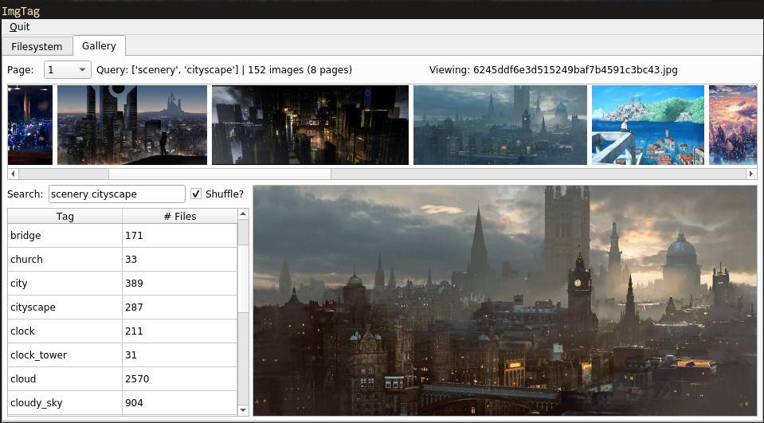

# imgtag

`imgtag` is a lightweight and minimalist desktop application for tagging and searching a collection of image files.

You may want to give it a try if you like the idea of "booru"-style imageboards but would like to:

- Run it locally for personal use
- Use your own filesystem as the backend
- Avoid the overhead of a running a full web stack (or embedded browser, as in other GUIs)

`imgtag` is written entirely in Python 3.7, using the Qt framework (via [PySide2](https://pypi.org/project/PySide2/)) for the UI and [peewee](https://github.com/coleifer/peewee/) as an ORM. All metadata is stored in a SQLite database.

All development and testing is currently done on Linux. It most likely runs on OS X, and maybe on Windows, but no guarantees.

An example of a gallery query by multiple tags:



## Running

Set the desired root directory for images in `config.ini`:
```
...
[filesystem]
root_dir = /path/to/your/pics
...
```

Make a virtualenv, install the dependencies, and run it:

```shell
$ python3.7 -m venv venv
$ . venv/bin/activate
$ pip install -r requirements.txt
$ python main.py
```

## Caveat

**Filenames are used as unique identifiers.** For example, two files located at `cats/image.jpg` and `dogs/image.jpg` respectively will be treated as the same image. A workaround - in lieu of ensuring filename uniqueness, e.g. via MD5 hashes - may be to maintain a parallel collection of symlinks with unique filenames. This may be added as feature in the near future.

## Design goals

- Core functionality should be minimal but easily extensible or scriptable for custom functionality
- Should not modify the actual files in any way
- Should be decently scalable via caching, lazy loading, etc.

## Core use cases

1. File view: Rate and tag images via a simple filesystem tree
2. Gallery view: Query images by arbitrary combinations of tags and rating

## Data model

The data model is kept as simple as possible to allow easy scripting. Essentially, images have a many-to-many relationship with tags. Image filepaths are also cached in the database for faster lookups. That's basically it.

Image tags created in `imgtag` can be easily ported other applications with simple queries, e.g.,

```sql
select file.name, tag.name
from filetag
inner join file on filetag.fil_id = file.id
inner join tag on filetag.tag_id = tag.id 
```

## Contributing

PRs are welcome - please run `make fmt` and `make lint` before commits.
